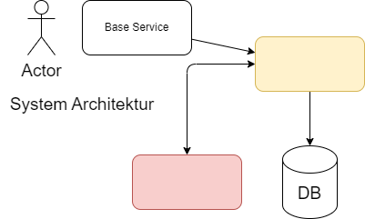
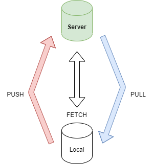

# WIFI SW Developer Kurs 2024
## Test

### Test 2

- punkt 1
- punkt 2
- punkt 3


Beispiel Code:

```csharp
    void Test()
    {
        System.Console.WriteLine();
    }
``` 

Dies ist **ein** *Test*.

Im folgende wird eine einfache Architektur dargestellt:



[Markdown Syntax Guide](https://www.markdownguide.org/basic-syntax/)

## Git Grundlagen

