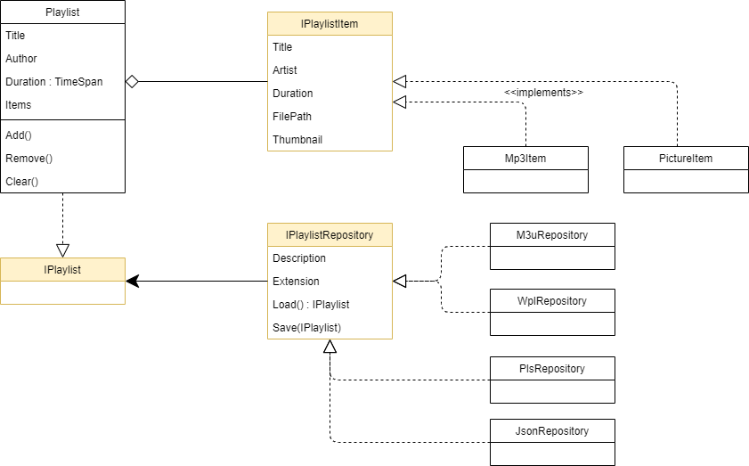

# WIFI PLAYLIST EDITOR

## Übersicht Klassen



## Grundlagen Unit-Tests

Für Unit-Tests wird ein Test-Framework verwendet. Wir verwenden in unserem Projekt das Framework **NUnit.nuget**. Damit der Test-Explorer im Visual Studio funktioniert muss zusätzlich das Nuget **NUnit3TestAdapter.nuget** installiert werden.
Für Ersatzobjekte (Mocks) wird das Package **Moq.nuget** verwendet.
Siehe dazu auch: [Leichter testen mit Moq](https://graberj.wordpress.com/2011/12/30/leichter-testen-mit-moq/) und [Unit Tests & Moq](https://robinsvahn.wordpress.com/2016/09/28/unit-tests-moq/).

```C#
 [TestFixture]
 public class PlaylistTests
 {
     private Playlist _fixture;
     private Mock<IPlaylistItem> _mockedItem;

     [SetUp]
     public void Init()
     {
         _fixture = new Playlist("Demo Playlist", "Testing");

         //setup mocked item
         _mockedItem = new Mock<IPlaylistItem>();
         _mockedItem.Setup(x => x.Duration).Returns(TimeSpan.FromSeconds(53));
     }

     [Test]
     public void FirstTest()
     {
         //arrange
         int erg = 0;

         //act
         erg = 5 + 6;

         //assert
         Assert.That(erg, Is.EqualTo(11));
     }
 }
```

Unit-Test Klassen werden mit dem Attribut ```[TestFixture]``` eingeleitet. Jede Test-Methode muss mit ```[Test]``` markiert werden. Die Methode mit dem Attribut ```[SetUp]``` wird vor jeder Test-Methode ausgeführt und kan für Initilisierungen und Vorbereitungen verwendet werden. 

Zum Thema kann das Buch [Art of Unit Testing](https://www.artofunittesting.com/) empfohlen werden.
